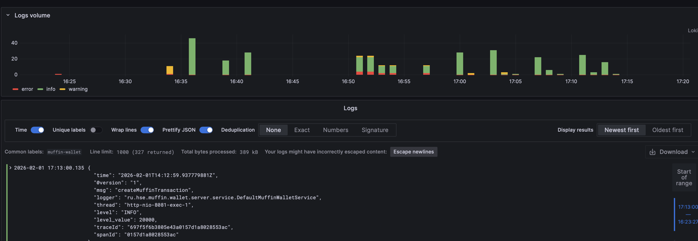
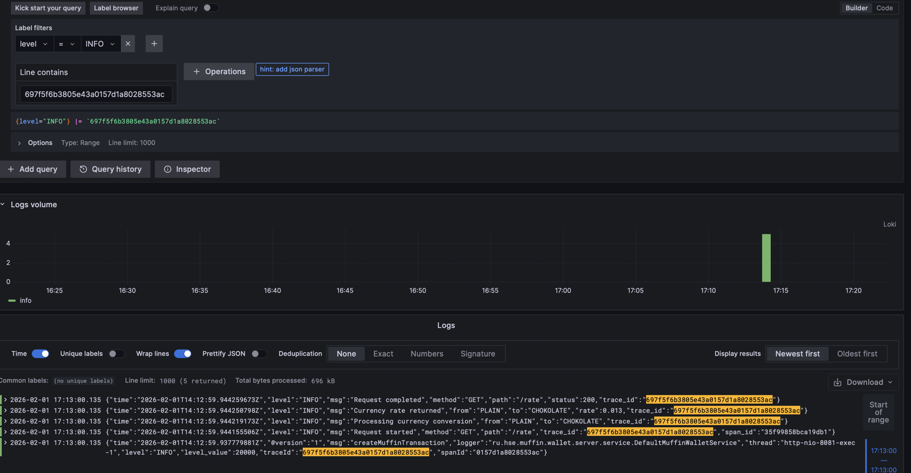
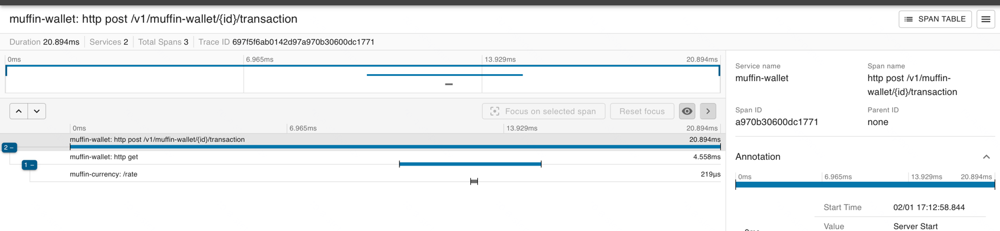
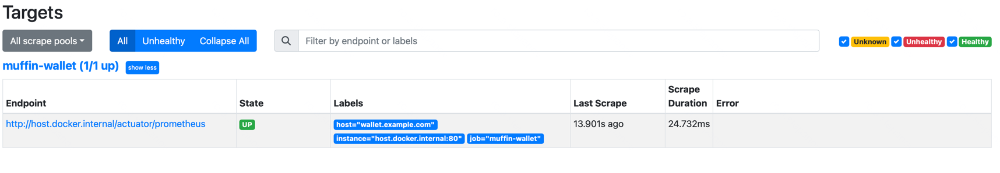
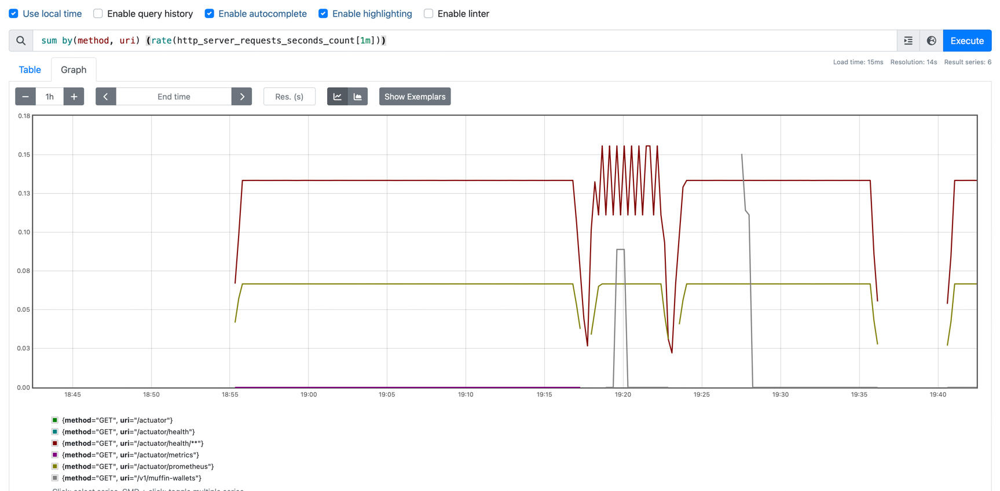
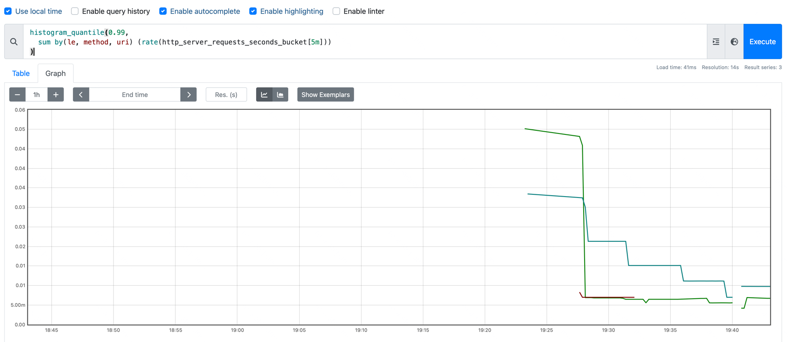
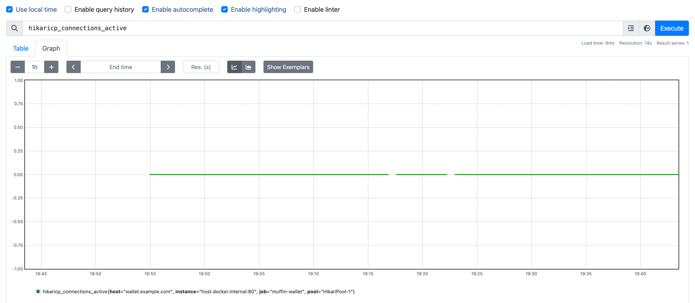

## что надо сделать:

1. запустить миникуб - minikube start --driver=docker
2. добавить ингресс плагин - minikube addons enable ingress
3. создание из чартов - cd chart && helmfile apply .

## СТЕК

* Для хранения логов использован loki - развернут через релиз loki-stack через хелмфайл
* Для сбора логов из приложения использованн alloy. Поднят в каждом приложении как сайдкар. СМ
  templates/deployments.containers у каждого приложения. Было доработано приложение wallet для того чтобы логи писались
  в файл в формате json при помощи logback. Alloy парсит json и записывает лейблы, которые использует локи для
  индексации данных
* Для трейсинга zipkin. Был доработан muffin-currency чтобы трейсы можно было с него тоже забирать


* чтобы воспользоваться графаной - пробросить порты через port forward или использовать minikube service grafana
* чтобы открыть интерфейс зипкина - пробросить порты через port forward или использовать minikube service zipkin
* чтобы работать с muffin-wallet - пробросить порты через port forward или использовать minikube service muffin-wallet

Транзакции работают (проверял)



можно искать по трейсу в графане



можно искать по трейсу в zipkin



Проверял, что локи персистентен - сносил весь релиз через helmfile destroy и заново накатывал, данные не
терялись.

Импортировать дашборд можно через ui графаны - файл grafana-dashboard.json

ВСЕ ЧТО НИЖЕ ЭТОЙ ЗАПИСИ ОТНОСИТСЯ К ДЗ ПО ПРОМЕТЕУСУ.
--------------------------------------
ПРОМЕТЕУС РАЗВЕРНУТ В docker-compose - осталось от предыдущей домашки

Перед началом надо добавить в /etc/hosts запись:

127.0.0.1 wallet.example.com

# create minikube

minikube start --driver=docker

# enable addos:

pod metrics

minikube addons enable metrics-server

ingress

minikube addons enable ingress

# apps

cd chart && helmfile apply

sudo minikube tunnel

база данных создается внутри кластера без pv + pvc потому что дз направленно не на правильное создание базы. В идеале я
бы развернул istio + sa на базу на железке (например развернутую локально в контейнере докера с volume), но это делать
дольше, чем создать тестовую базу в манифесте

# Prometheus

Прометеус описан в prometheus-monitoring и docker-compose. Для того чтобы поднять прометеус - в корне репозитория:
docker-compose up. После этого надо зайти в ui по адресу http://localhost:9090

Если приложение запущено, то в Status -> Targets будет 

## Запросы

В Graph можно вводить следующие запросы / строить панели:

RPS по методам:
`sum by(method, uri) (rate(http_server_requests_seconds_count[1m]))`


99-й перцентиль по методам и uri:

```
histogram_quantile(0.99,
  sum by(le, method, uri) (rate(http_server_requests_seconds_bucket[5m]))
)
```



Активные соединения с БД: `hikaricp_connections_active`


